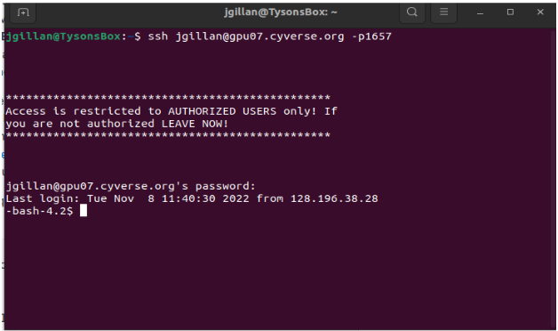
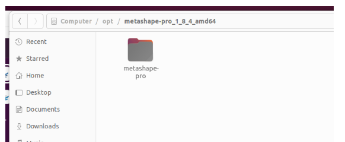
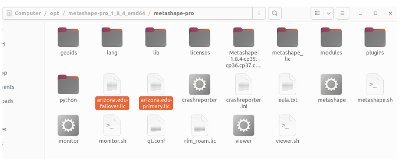
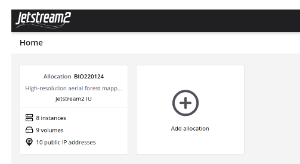
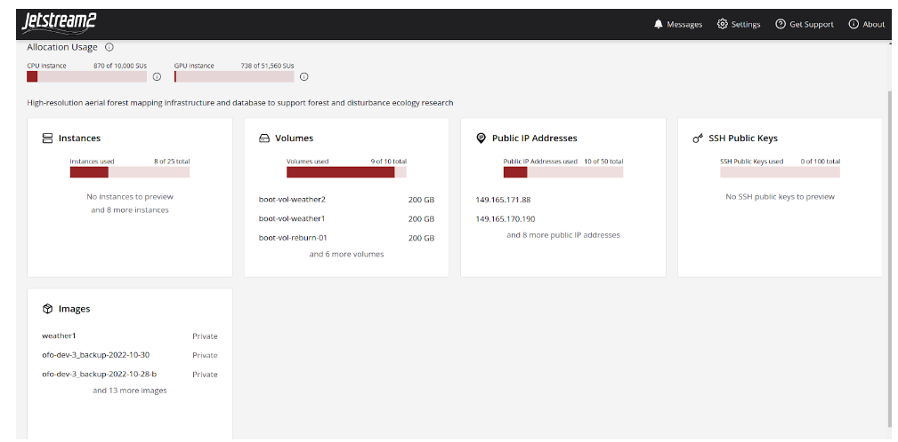
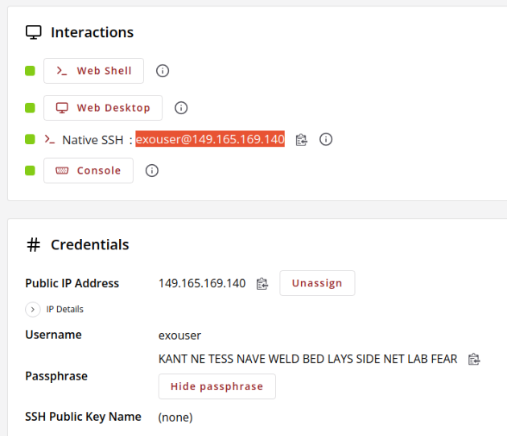

# Metashape_on_Jetstream2
These are my ongoing notes on doing networked photogrammetry processing with Agisoft Metashape on Jetstream2.

## Remotely connecting to in-house resources gpu06 and gpu07
Gpu06 & gpu07 are high performance linux servers location in UITS on UA campus. They each have 2 x Nvidia GTX 1080 gpu processors. 

You can connect via ssh in a terminal or in VS Code

ssh jgillan@gpu06.cyverse.org -p1657  or ssh jgillan@128.196.254.151 -p1657  
ssh jgillan@gpu07.cyverse.org -p1657  or ssh jgillan@128.196.254.89 -p1657

Use Cyverse password

## Installation location for Metashape on Linux machines
* Am I really 'installing' it? It just sits in a folder

* Licensing Metashape is done by putting these two files directly into the 'metashape-pro' folder. The lic files are pointing to a license server in UITS. I think we have 20 metashape pro license. 

## Transfer a file from local machine to remote machine such as gpu06 or gpu07
* I needed to copy the license files from my local machine to gpu06  
 
sudo rsync -a -e "ssh -p 1657" /opt/metashape-pro_1_8_4_amd64/metashape-pro/arizona.edu-primary.lic jgillan@gpu06.cyverse.org:/opt/metashape-pro  
 

* Make sure you have read/write/execute permissions for the home folder and for the destination folder. If not, you will get ‘Permission denied’. 
* Change permissions with 'chmod' command

## Connecting to gpu06 or gpu07 with graphical remote desktop
* Gpu06 & 07 do not have desktops so we can’t remote into them.
* Instead, you can create a container on gpu06 with desktop and software
Connect to gpu06 with ssh (shown above) in a local terminal
Once in gpu06, you are going to start a Docker container which should contain metashape and other dependencies

export DISPLAY=:0
xinit &
docker run --gpus all --rm -it -p 9876:9876 -v /tmp/.X11-unix:/tmp/.X11-unix -e DISPLAY -e XAUTHORITY -e QT_X11_NO_MITSHM=1 -e NVIDIA_DRIVER_CAPABILITIES=all harbor.cyverse.org/vice/xpra/cudagl:20.04

You can view the docker container in the local machine web browser
http://gpu06.cyverse.org:9876/

## Jetstream2 Notes

* Jetstream2 is a supercomputer cluster based at University of Indiana. Only NSF funded researchers and affiliates get access.

* To get access, you must have a login with ACCESS (https://access-ci.org/; formally called Xcede)

* Jetstream login location: https://jetstream-cloud.org/

* We are using the ‘Exosphere’ interface for Jetstream2

* An Instance is a virtual machine (VM)
* You can choose different sizes (cores, GPUs) of VM instances
* 'Shelving' an instance means it is not using any resources of our allocation. If VMs are up and running, they are using allocation.
* ofo-dev-03 and ofo-dev-05 have a 5TB shared volume mounted at /mnt/ofo-share-01
* The public IP addresses can be used to remote into the VMs using ssh on the command line 
* For example, ssh exouser@149.165.169.140

