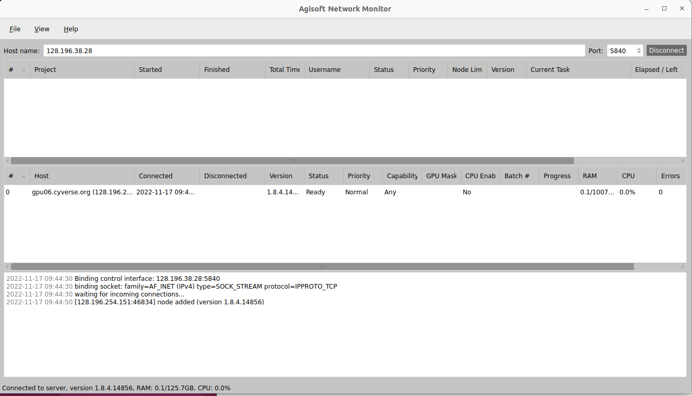

# Metashape_on_Jetstream2
These are my ongoing notes on doing networked photogrammetry processing with Agisoft Metashape on Jetstream2.


* Jetstream2 is a supercomputer cluster based at University of Indiana. Only NSF funded researchers and affiliates get access.

* To get access, you must have a login with ACCESS (https://access-ci.org/; formally called Xcede)

* Jetstream login location: https://jetstream-cloud.org/

* We are using the ‘Exosphere’ interface for Jetstream2


* An Instance is a virtual machine (VM)
* You can choose different sizes (cores, GPUs) of VM instances
* 'Shelving' an instance means it is not using any resources of our allocation. If VMs are up and running, they are using allocation.
* ofo-dev-03 and ofo-dev-05 have a 5TB shared volume mounted at /mnt/ofo-share-01
* The public IP addresses can be used to remote into the VMs using ssh on the command line 
* For example, ssh exouser@149.165.169.140


## Network Processing with Exosphere
The following methods describe how to start network processing across multiple VMs through the Exosphere interface of Jetstream2. It guides users through starting 'server' and 'processing nodes' and executes Metashape processes through the Metashape graphical user interface. This is used to prove the concept of network processing and understand how multiple VMs are communicating with one another. Real operations of network processing need to be developed with calls to the Python API instead of using the Metashape GUI. Documentation of Metashape network processing is found in the user manual here: https://www.agisoft.com/pdf/metashape-pro_1_8_en.pdf. Check out Chapter 8 Distributed Processing (starting on page 150)

For a simple test of network processing, we can start three virtual machines on Jetstream2. One will be a small CPU machine (server), and the other two will be small GPU machines (processing nodes). You can use 'dev-claire' as the CPU server instance. Use 'Jeff_test_GPU' and 'GPU_test_Jeff2' for the GPU processing nodes. 

Each VM instance needs to have Metashape 1.8.4 at ```/opt/metashape-pro```. Additionally, each instance needs a Metashape license (arizona.edu-primary.lic) located at ```/opt/metashape-pro```. 

### Start the server instance in server mode
* Open the guacole desktop for the cpu VM (dev-claire)
* Open a terminal and type these commands. The string of numbers after '--host' is the internal IP address of the cpu VM. This address will vary for every instance. 
```
cd /opt/metashape-pro
   
./metashape.sh --server --host 10.0.205.199
```


### Set Network Processing Preferences in Metashape GUI
* Open a new terminal window and launch the Metashape GUI
```
cd /opt/metashape-pro
 
./metashape.sh 
```
* Navigate to and open the Network Preferences tab
* Check 'Enable network processing'
* Type in the Host name: this the is Public IP address (not the internal) of the VM.
* Port is 5840
* Root is the path to the shared directory. This is the location of the benchmark imagery dataset. 
```
/mnt/ofo-share-01/jetstream-benchmark/jetstream2-benchmark/dataset
```


### Set Network and GPU Preferences on GPU VMs
* These instructions will be the same for the both GPU processing nodes ('Jeff_test_GPU' and 'GPU_test_Jeff2')
* Open the guacole desktop for a GPU VM 
* Open a terminal and launch the Metashape GUI

```
cd /opt/metashape-pro
./metashape.sh
```

<br />
<br />
<br />
<br />


## Remotely connecting to in-house resources gpu06 and gpu07
Gpu06 & gpu07 are high performance linux servers location in UITS on UA campus. They each have 2 x Nvidia GTX 1080 gpu processors. 

You can connect via ssh in a terminal or in VS Code

ssh jgillan@gpu06.cyverse.org -p1657  or ssh jgillan@128.196.254.151 -p1657  
ssh jgillan@gpu07.cyverse.org -p1657  or ssh jgillan@128.196.254.89 -p1657

Use Cyverse password


<br />
<br />
## Installation location for Metashape on Linux machines
* Find the linux version of Metashape here: https://agisoft.freshdesk.com/support/solutions/articles/31000160235-how-to-install-agisoft-metashape
* Instead of installing it, it just sits in the 'opt' folder


<br />
<br />
## Licensing Metashape
* Licensing Metashape is done by putting these two files directly into the 'metashape-pro' folder. The lic files are pointing to a license server in UITS. I think we have 20 metashape pro license. 


<br />
<br />

## Downloading and Installing Metashape Python API Module
    sudo wget https://s3-eu-west-1.amazonaws.com/download.agisoft.com/Metashape-1.8.4-cp35.cp36.cp37.cp38-abi3-linux_x86_64.whl
<br />

    pip install Metashape-1.8.4-cp35.cp36.cp37.cp38-abi3-linux_x86_64.whl 
<br />

I do not know if I did this correct. The terminal said it installed, but where exactly?
<br />
<br />

## Transfer a file from local machine to remote machine such as gpu06 or gpu07
* I needed to copy the license files from my local machine to gpu06. In a terminal, use the 'rsync' command to transfer between machines <br />
```
sudo rsync -a -e "ssh -p 1657" /opt/metashape-pro_1_8_4_amd64/metashape-pro/arizona.edu-primary.lic jgillan@gpu06.cyverse.org:/opt/metashape-pro 
```
* Make sure you have read/write/execute permissions for the home folder and for the destination folder. If not, you will get ‘Permission denied’. 
* Change permissions with 'chmod' command
<br />
<br />

## Remote mount between local machine and remote machine

    sudo sshfs -o allow_other jgillan@gpu06.cyverse.org:/mnt/drone_imagery -p1657 /mnt/drone_imagery


## Move drone images from local machine to gpu06
    sudo rsync -a -e "ssh -p1657" /media/jgillan/7a593008-f9d4-48b8-aece-6fb637b5b0bc/jeffs_stuff/Black_mypassport_1.8TB/Smith_vanLeeuwen_work/RainMan/drone_imagery/100_0019/ jgillan@gpu06.cyverse.org:/home/jgillan/drone_imagery
<br />

* The trailing'/' means copy the contents of the directory, but not the directory itself

## Connecting to gpu06 or gpu07 with graphical remote desktop
* Gpu06 & 07 do not have desktops so we can’t remote into them.
* Instead, you can create a container on gpu06 with desktop and software
* Connect to gpu06 with ssh (shown above) in a local terminal
* Once in gpu06, you are going to start a Docker container which should contain metashape and other dependencies
```
    export DISPLAY=:0
    xinit &
    docker run --gpus all --rm -it -p 9876:9876 -v /tmp/.X11-unix:/tmp/.X11-unix -e DISPLAY -e XAUTHORITY -e QT_X11_NO_MITSHM=1 -e         NVIDIA_DRIVER_CAPABILITIES=all harbor.cyverse.org/vice/xpra/cudagl:20.04
```
You can view the docker container in the local machine web browser
http://gpu06.cyverse.org:9876/
<br />
<br />
<br />

## Agisoft Metashape Network Processing v 1.8
* Read the Metashape user manual here: https://www.agisoft.com/pdf/metashape-pro_1_8_en.pdf
* The server instance of Metashape will be the local linux machine (e.g., TysonsBox). This coordinates the processing jobs but does not actually do any processing
* 'Processing nodes' will be gpu06 and gpu07
* A 'client' is the Agisoft Network Monitor. 
* Imagery storage for now is at: jgillan@gpu06.cyverse.org:/home/jgillan/drone_imagery
* To use more than one 'processing node' there needs to be a storage that is shared between gpu06 and gpu07

### Start the server instance in server mode
* Open a terminal on the server machine 
```
cd /opt/metashape-pro
   
./metashape.sh --server --host 128.196.38.28:5840
```

### Start the processing node on gpu06
* ssh into the processing node machine (gpu06) and open a terminal
```
cd /opt/metashape-pro
    
sudo ./metashape --node --host 128.196.38.28:5840 --platform offscreen --root /mnt/drone_imagery
```

### Check status of network connections
* Open the Agisoft network monitor
```
cd /opt/metashape-pro

./monitor.sh
```
* Input the IP address of the server instance (e.g., 128.196.38.28 for local linux) 
* Port is 5840 (default)
* Press `Connect` button



<br />
I was able to make the network processing work when I made gpu06 the server node, and local machine the processing node. 


