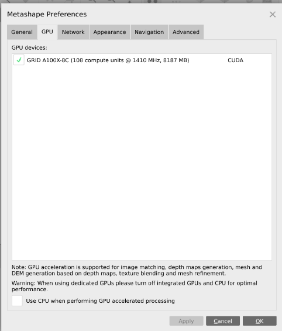

# Metashape_on_Jetstream2
These are my ongoing notes on doing networked photogrammetry processing with Agisoft Metashape on Jetstream2.


* Jetstream2 is a supercomputer cluster based at University of Indiana. Only NSF funded researchers and affiliates get access.

* To get access, you must have a login with ACCESS (https://access-ci.org/; formally called Xcede)

* Jetstream login location: https://jetstream-cloud.org/

* We are using the ‘Exosphere’ interface for Jetstream2


* An Instance is a virtual machine (VM)
* You can choose different sizes (cores, GPUs) of VM instances
* 'Shelving' an instance means it is not using any resources of our allocation. If VMs are up and running, they are using allocation.
* ofo-dev-03 and ofo-dev-05 have a 5TB shared volume mounted at /mnt/ofo-share-01
* The public IP addresses can be used to remote into the VMs using ssh on the command line 
* For example, ssh exouser@149.165.169.140


## Network Processing with Exosphere
The following methods describe how to start network processing across multiple VMs through the Exosphere interface of Jetstream2. It guides users through starting 'server' and 'processing nodes' and executes Metashape processes through the Metashape graphical user interface. This is used to prove the concept of network processing and understand how multiple VMs are communicating with one another. Real operations of network processing need to be developed with calls to the Python API instead of using the Metashape GUI. Documentation of Metashape network processing is found in the user manual here: https://www.agisoft.com/pdf/metashape-pro_1_8_en.pdf. Check out Chapter 8 Distributed Processing (starting on page 150)

For a simple test of network processing, we can start three virtual machines on Jetstream2. One will be a small CPU machine (server), and the other two will be small GPU machines (processing nodes). You can use 'dev-claire' as the CPU server instance. Use 'Jeff_test_GPU' and 'GPU_test_Jeff2' for the GPU processing nodes. 

Each VM instance needs to have Metashape 1.8.4 at ```/opt/metashape-pro```. Additionally, each instance needs a Metashape license (arizona.edu-primary.lic) located at ```/opt/metashape-pro```. 

### Start the server instance in server mode
* Open the guacole desktop for the cpu VM (dev-claire)
* Open a terminal and type these commands. The string of numbers after '--host' is the internal IP address of the cpu VM. This address will vary for every instance. 
```
cd /opt/metashape-pro
   
./metashape.sh --server --host 10.0.205.199
```


### Set Network Processing Preferences in Metashape GUI
* Open a new terminal window and launch the Metashape GUI
```
cd /opt/metashape-pro
 
./metashape.sh 
```
* Navigate to and open the Network Preferences tab
* Check 'Enable network processing'
* Type in the Host name: this the is Public IP address (not the internal) of the VM.
* Port is 5840
* Root is the path to the shared directory. This is the location of the benchmark imagery dataset. 
```
/mnt/ofo-share-01/jetstream-benchmark/jetstream2-benchmark/dataset
```

* You can leave this GUI open and running, we will come back to it later. 

### Launch Network Monitor
* Open a new terminal tab (on the cpu VM) and launch the monitor

```
cd /opt/metashape-pro
 
./monitor.sh 
```
* Type in the Host name. This should be the public IP address of the server instance (aka the cpu VM). Press the Connect button. There should be an indication that the monitor is now communicating with the server instance. 


### Set Network and GPU Preferences on GPU VMs
* These instructions will be the same for the both GPU processing nodes ('Jeff_test_GPU' and 'GPU_test_Jeff2')
* Open the guacole desktop for a GPU VM 
* Open a terminal and launch the Metashape GUI

```
cd /opt/metashape-pro
./metashape.sh
```
* In the Metashape GUI, open the GPU Preferences tab
* Make sure there is a GPU device and it is checked



* In Network Preferences tab, fill out the information just like you did for the server instance. The host is the pubic IP address of the server instance. 


* You can close the Metashape GUI on the 'processing node' instance.

### Start the processing node in node mode
* Open a terminal on desktop of the GPU VM
* Launch a metashape node

```
cd /opt/metashape-pro
./metashape.sh --node --host 149.165.171.36:5840 --root /mnt/ofo-share-01/jetstream-benchmark/jetstream2-benchmark-dataset
```


* There are several other flags you can add to this launch command. They include the ability to designate the processing nodes as CPU or GPU, assign priorities to the nodes, and enable/disable GPU devices with a mask. I don't totally understand the GPU mask yet. Consult the instruction manual https://www.agisoft.com/pdf/metashape-pro_1_8_en.pdf.

* To make sure the node is connected and communicating with the server, check the Network Monitor (this should still be running on the cpu VM)
* You should see a connection from one of the GPU VMs (jeff_test_GPU, gpu_test_jeff2)

### Open a .psx file in Metashape GUI and Launch Photogrammetry Processes
* Go back to the Metashape GUI that is launched from the cpu VM. 
* Open an existing project .psx file. I have one located on the shared drive ```/mnt/ofo-share-01/jetstream-benchmark/jetstream2-benchmark-dataset/network_test.psx``` I'm not sure if projects need to be saved on shared drive, but probably. 


* Within the Metashape GUI, start a photogrammetry process such as 'Align Photos'. Yes of course you want to process over network!

  

* If the network processing is successful, you should see indicators in the Metashape GUI (i.e., no failures). Check the monitor to see how your processing job is going!


